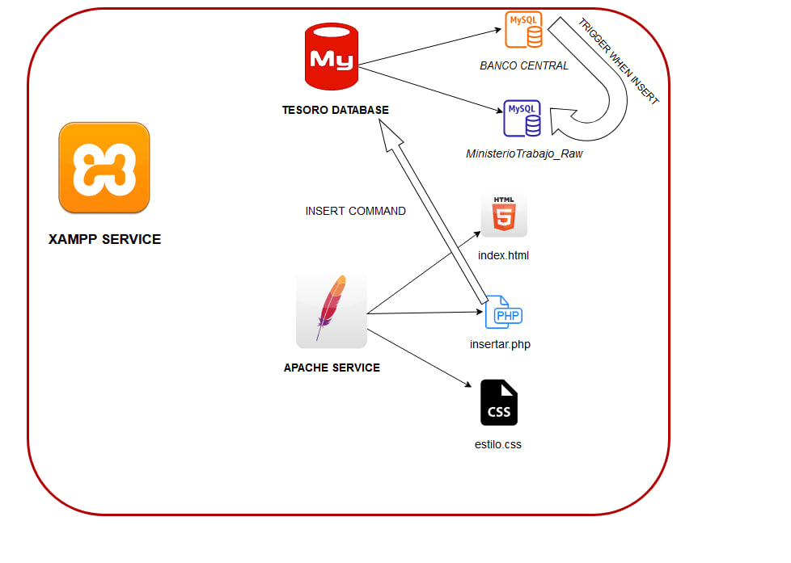

# Proyecto: DEV_tesoro_Publico
### 👨🏻‍💻 Author: Manuel Alén
### ✉️ e-mail: manualen@protonmail.com
## Descripción

Proyecto que muestra cómo se produce la creación de dinero en un Estado con soberanía monetaria plena. Estas Ejecuciones  se han realizado para lograr un grado alto de automatización. La idea es automatizar todo este proceso y se consiga una gestión de procesos eficientes.

## Contexto

Se presupone un contexto en el que este Estado tendría soberanía monetaria plena y desarollaría un Plan de Trabajo Garantizado, se planificaría la economía y se digitalizaría mucho más la economía nacional.

## Pasos a seguir

1. Ejecutar el script de sql para preparar el entorno de MySQL.
2. Preparar el entorno web. En caso de utilizar Windows, llevar los documentos a C:\xampp\htdocs, en Linux a /var/www/
3. Tener activos los servicios de apache y mysql.

## POC: Prueba de Concepto

